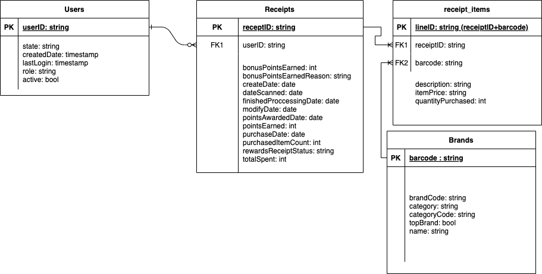
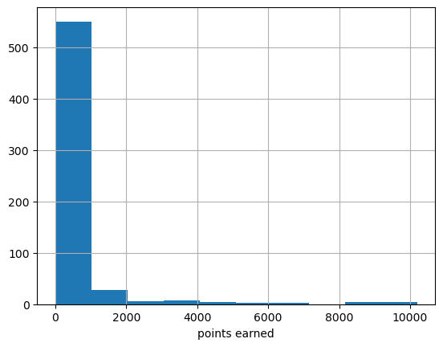

# fetch_takehome
Fetch Take Home Assignment

Part 1, as you can see I chose to split the schema into 4 tables, and chose to rename _id as a more informative name such as userID.
For the sake of efficiency of querying, I chose to flatten out the list of items on a given receipt since there was already columns for aggregated quantity and paid amount for the order, and this would allow an analyst to get insights into brands without needing to do a cost unnest operation each time (tradeoff of write vs compute)



for part 2, assuming Snowflake for DWH
### What are the top 5 brands by receipts scanned for most recent month?

```sql
WITH most_recent_transactions_agg AS (
    SELECT 
      b.name
    , COUNT(DISTINCT r.receiptID) AS cnt
    FROM brands b
    LEFT JOIN receipt_items ri 
    ON b.barcode = ri.barcode
    LEFT JOIN receipts r 
    ON ri.receiptID = r.receiptID 
    WHERE r.dateScanned >= ADD_MONTHS(CURRENT_DATE(), -1)
    GROUP BY b.name
)
SELECT name
FROM most_recent_transactions_agg
ORDER BY cnt DESC
LIMIT 5
```
### How does the ranking of the top 5 brands by receipts scanned for the recent month compare to the ranking for the previous month?
```sql
WITH most_recent_transactions_agg AS (
    SELECT 
      b.name
    , COUNT(DISTINCT r.receiptID) AS cnt
    FROM brands b
    LEFT JOIN receipt_items ri 
    ON b.barcode = ri.barcode
    LEFT JOIN receipts r 
    ON ri.receiptID = r.receiptID 
    WHERE r.dateScanned >= ADD_MONTHS(CURRENT_DATE(), -1)
    GROUP BY b.name
),
prior_month AS (
    SELECT 
      b.name
    , COUNT(DISTINCT r.receiptID) AS cnt
    FROM brands b
    LEFT JOIN receipt_items ri 
    ON b.barcode = ri.barcode
    LEFT JOIN receipts r 
    ON ri.receiptID = r.receiptID 
    WHERE r.dateScanned BETWEEN ADD_MONTHS(CURRENT_DATE(), -2) 
    AND ADD_MONTHS(CURRENT_DATE(), -1)
    GROUP BY b.name
)
SELECT a.name, 
dense_rank() OVER (ORDER BY a.cnt DESC) AS current_ranking,
dense_rank() OVER (ORDER BY b.cnt DESC) AS prior_ranking,
FROM most_recent_transactions_agg a
LEFT JOIN prior_month b 
ON a.name = b.name
ORDER BY a.cnt DESC
LIMIT 5

```
### When considering average spend from receipts with 'rewardsReceiptStatus’ of ‘Accepted’ or ‘Rejected’, which is greater?
```sql
Select 
AVG( CASE 
WHEN rewardsReceiptStatus = “Accepted” THEN totalSpent 
ELSE NULL 
END) AS avg_accepted,
AVG( CASE 
when rewardsReceiptStatus = “Rejected” THEN totalSpent 
ELSE NULL 
END) AS avg_rejected
FROM receipts
```

### When considering total number of items purchased from receipts with 'rewardsReceiptStatus’ of ‘Accepted’ or ‘Rejected’, which is greater?
```sql
SLECT 
SUM( CASE 
WHEN rewardsReceiptStatus = “Accepted” THEN purchasedItemCount 
ELSE NULL 
END) AS items_accepted,
SUM( CASE 
WHEN rewardsReceiptStatus = “Rejected” THEN purchasedItemCount 
ELSE NULL 
END) AS items_rejected
FROM receipts
```
### Which brand has the most spEND among users who were created within the past 6 months?
```sql
WITH new_users AS (
SELECT userID
FROM users
WHERE createdDate > ADD_MONTHS(CURRENT_DATE(), -6)
),
spend_by_brand AS (
    SELECT b.name, sum(totalSpent) AS spend
FROM receipts r
INNER JOIN new_users n
ON r.userID = n.userID
LEFT JOIN receipt_items ri 
ON ri.receiptID = r.receiptID 
LEFT JOIN brands b
ON b.barcode = ri.barcode
GROUP BY b.name
)

SELECT TOP name
FROM spend_by_brand
ORDER BY spend


```
### Which brand has the most transactions among users who were created within the past 6 months?
```sql
WITH new_users AS (
SELECT userID
FROM users
WHERE createdDate > ADD_MONTHS(CURRENT_DATE(), -6)
),
transactions_by_brand AS (
    SELECT b.name, COUNT( DISTINCT r.receiptID) AS transactions
FROM receipts r
INNER JOIN new_users n
ON r.userID = n.userID
LEFT JOIN receipt_items ri 
ON ri.receiptID = r.receiptID 
LEFT JOIN brands b
ON b.barcode = ri.barcode
GROUP BY b.name
)

SELECT TOP name
FROM transactions
ORDER BY transactions

```
### Potential Slack message 

Hey Team,

I looked over the source data and have a few concerns.
* First of all, it appears that multiple brands are using the same barcode. As this is the only way we currently have to connect a receipt to a brand, this is going to cause misleading figures for any brand based statistics as we cannot know which brand the customer purchased. I would ask if there was another way of connecting the brand data to the purchase information, but we also are missing 55% of the barcodes for receipts that had a list of items purchased, as well as 39% of all receipts not listing the items purchased. With this in mind, we have some serious data collection concerns.
* We also do not have a single unique ID in the users table. I am not sure how we are pulling this information, but it would seem we need to purge old records somewhere upstream. This will lead to massive scaling issues as duplicate join keys can increase costs exponentially as you increase the amount of duplication, I would recomend only taking the latest non-empty value for a given user.
* Is there a maximum amount of points a user can earn in a transaction? As we can see in the attached graph, there are some pretty high outliers, earning nearly 100x what the bulk of orders earned. If there isn't we should likely include one, or have some way of stratifying rewards
* Lastly, for nearly half of all receipts, Total Spend, Purchased Item Count, and Points Earned are missing. As we are a rewards company, this is fairly essential data if we want to be even marginally insightful with our customers. I think we need to pull the @appteam in here to better understand where the gap is. 

Feel free to respond in the thread below, but this is all highly concerning, and may need to be addressed with a few cross team syncs.



